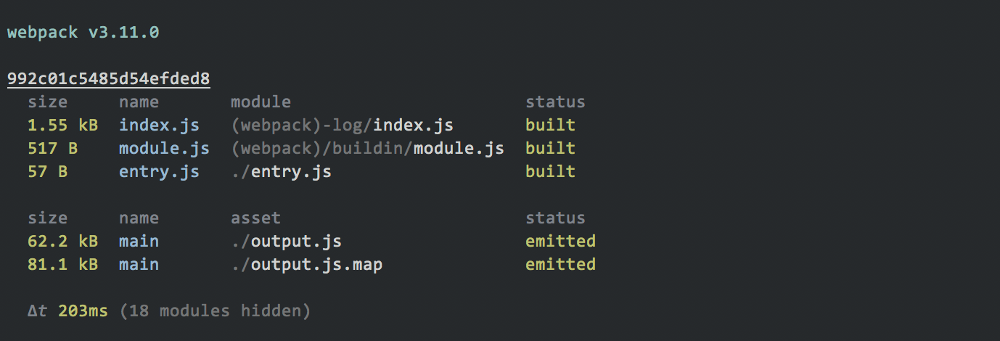
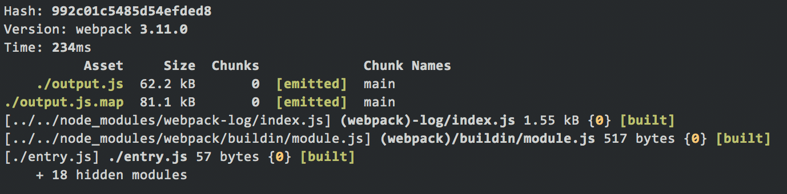

<div align="center">
  <a href="https://github.com/webpack/webpack">
    
  </a>
</div>

[![npm][npm]][npm-url]
[![node][node]][node-url]
[![deps][deps]][deps-url]
[![tests][tests]][tests-url]
[![chat][chat]][chat-url]

# webpack-stylish

A stylish, opinionated reporter for webpack.



Compared to the default output:



Let's be honest, the default build output for webpack wouldn't exactly hang in
the Louvre. Great tools should have beautiful output. This reporter is
specifically structured to present common, important¹ information about a build
in a visually pleasing and easy-to-read format and style.

¹ _subjective, but based on shared experiences._

## Getting Started

To begin, you'll need to install `webpack-stylish`:

```console
$ npm install webpack-stylish --save-dev
```

Then add the reporter as a plugin to your `webpack` config. For example:

```js
const path = require('path');
const webpack = require('webpack');
const Stylish = require('webpack-stylish');

module.exports = {
  context: path.resolve(__dirname),
  devtool: 'source-map',
  entry: './entry.js',
  output: {
    filename: './output.js',
    path: path.resolve(__dirname)
  },
  plugins: [
    new webpack.NamedModulesPlugin(),
    new Stylish()
  ]
};
```

### MultiCompilers

If you use a config that consists of an array of configs (aka. `MultiCompiler`),
we recommend using _a single instance_ of the reporter across all configs. eg;

```js
const StylishReporter = require('webpack-stylish');
const stylish = new StylishReporter();

module.exports = [
  {
    ...
    plugins: [
      new webpack.NamedModulesPlugin(),
      stylish
    ]
  },
  {
    ...
    plugins: [
      new webpack.NamedModulesPlugin(),
      stylish
    ]
  }
];
```

Internally, the reporter will keep track of the compiler instances it's been
added to and will display summary information for all compilers. If you _don't_
use a single, shared instance of the reporter, you're going to see a lot of
duplicate information, and that'd just be silly.

### Webpack CLI

Because `webpack-cli` reads the `stats` config property _before_ the compilation
starts, it tends to go on doing it's own thing. When using `webpack-stylish` in
a config that you're running via the CLI, you need to add `stats: 'none'` to the
config. Otherwise you'll see both this reporter's output, **and** the CLI's.

## Options

There are none! If you're in need of fine-grained control of webpack's build
information out, please don't use this reporter. Instead, you can fine-tune
webpack's default output via the
[`stats` config property](https://webpack.js.org/configuration/stats/#stats).

## Gotchas

The `webpack-stylish` reporter will _straight up ignore_ the `stats` property in
your `webpack` config, if you have one set. _(This reporter is opinionated!)_.

### Naughty Loaders and Plugins

Some loaders and plugins are going to need a spanking. For they have been naughty
and are pushing wonky formatting and multiple-errors-packed-into-one errors onto
a compliation's error and/or warning stacks. `webpack-stylish` does it's best
to compensate for that, but be aware that some plugins will cause some wonky
output. For example, `stylelint-webpack-plugin` is guilty of this.

It's impossible for us to test the world (aka. every plugin ever) so if
you see something off, please open an issue and let us know. We'll either
compensate further in the code here, or try to bring the offending plugin or
loader into the light.

## Contributing

We welcome your contributions! Please have a read of
[CONTRIBUTING.md](CONTRIBUTING.md) for more information on how to get involved.

## License

#### [MIT](./LICENSE)

[npm]: https://img.shields.io/npm/v/webpack-stylish.svg
[npm-url]: https://npmjs.com/package/webpack-stylish

[node]: https://img.shields.io/node/v/webpack-stylish.svg
[node-url]: https://nodejs.org

[deps]: https://david-dm.org/webpack-contrib/webpack-stylish.svg
[deps-url]: https://david-dm.org/webpack-contrib/webpack-stylish

[tests]: http://img.shields.io/travis/webpack-contrib/webpack-stylish.svg
[tests-url]: https://travis-ci.org/webpack-contrib/webpack-stylish

[chat]: https://badges.gitter.im/webpack/webpack.svg
[chat-url]: https://gitter.im/webpack/webpack
